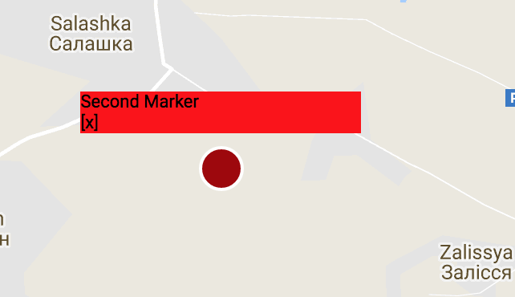

# React Store Locator

## Short Description

This module is used for when you have a list of stores/dealers that you wish to put on a map and show information about each store/dealer.

## Getting started

```bash
yarn add react-store-locator

npm install --save react-store-locator
```

Make sure you have yarn installed if you wish to use it

## Usage

### Basic

```jsx
import { Map } from 'react-store-locator';

render(){
  const dealers = [
    {
    id: 1,
    lat: 50,
    lng: 25.1,
    show: false,
    name: 'First Marker'
  },
  {
    id: 2,
    lat: 50,
    lng: 25.2,
    show: true,
    name: 'Second Marker'
  },
  {
    id: 3,
    lat: 50,
    lng: 25.3,
    show: false,
    name: 'Third Marker'
  }
  ]
  return(
    <Map dealers={dealers}/>
  )
}
```

This will show a map with default markers and default info windows.

You will need to include all of these props for a minimum for each of your markers. If you wish your information to `show` by default then set `show` to true otherwise set `show` to false.

### Start customizing

You can add your own custom pin and information window. Examples below.

```jsx
import { Info } from 'react-store-locator';

\\...

return (
  <Map dealers={dealers}>
    {(dealer, closeDealer) => {
        return (
         <Info show={dealer.show}>
            <div style={{ background: 'red' }}>
              {dealer.name}
              <div onClick={() => closeDealer(dealer.id)}>[x]</div>
            </div>
          </Info>
        );
      }}
  </Map>
)
```

You must pass `show` prop if you want your info window to work correctly. Pass any jsx through the `Info` tag and it will be displayed. There you can style this however you wish.

Here is what you get:

Without any styles:


With styles:

